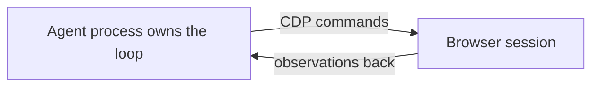
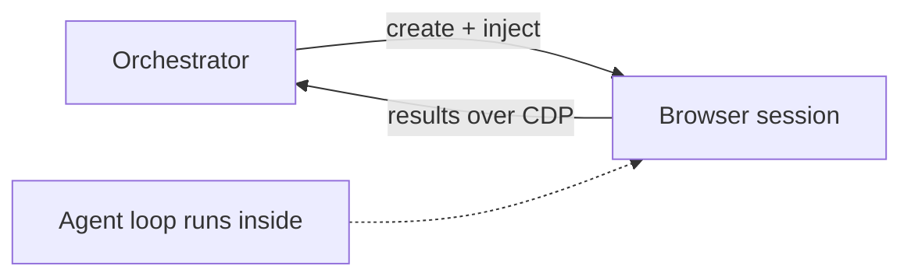

Most browser agents sit on the outside. The agent process owns the loop, the browser is a puppet, and every observation and action crosses the wire between them.

That's [Browser Use](https://browser-use.com/posts/playwright-to-cdp), [Skyvern](https://github.com/skyvern-ai/skyvern), [Browserbase's Stagehand](https://github.com/browserbase/stagehand), Anthropic's Computer Use, and [Google's Chrome DevTools for Agents](https://developer.chrome.com/blog/devtools-for-agents-v1) — every prominent one driving a remote target over CDP. The two most watched just doubled down rather than rethought it: Browser Use [stripped out Playwright](https://browser-use.com/posts/playwright-to-cdp) to speak raw CDP, and Stagehand v3 [did the same](https://www.unbrowse.ai/blog/best-ai-browser-agents-2026). They moved closer to the wire and stayed on the same side of it.

It's not the only shape that exists — there's a real in-browser camp I'll come back to — but it's the dominant one, and it kept hitting a ceiling on me.

Last week I flipped it. The agent now lives *inside* the browser.

## The dominant architecture, and where it starts to hurt

Here's the shape almost everyone ships:

The agent process holds the loop. The browser is a puppet. Every observation and action crosses the wire. I do growth work with [Steel](https://steel.dev/) — the cloud-browser company purpose-built for this kind of agent — so I spend a lot of time staring at this architecture, and three things about it genuinely hurt:

- **Chattiness.** Navigate, wait, snapshot, decide, click, wait, snapshot. The interesting work is interleaved with a constant back-and-forth that taxes you in latency and tokens.
- **The session's life is coupled to the driver's life.** Kill the agent process and the session becomes an orphan. There's no natural "start it, leave, come back tomorrow" — the thing doing the driving is also the thing keeping the work alive.
- **One tab at a time.** Most of these harnesses think in terms of a single focused tab. Fan-out means fanning out *sessions*, each its own puppet on its own string.

The external camp has been working hard on the chattiness — that's exactly what those Playwright-to-raw-CDP moves are about, killing a relay hop. But moving the driver closer to the wire doesn't change *which side* the driver is on.

## The inversion

So I inverted it. Take a small browsing harness I'd already built and repackage the loop as a Chrome extension. Inject that extension into a [Steel session](https://docs.steel.dev/overview/sessions-api/session-lifecycle) at creation time. The agent boots *with* the browser, does the work, and hands results back to an orchestrator.

Notice what actually moved: **the control loop went inside. CDP didn't disappear — it got demoted.** In the old shape CDP is the control channel; every decision crosses it. In this shape CDP is just the results channel. The thinking happens inside the session now.

<blockquote class="featured-quote primary">
The inversion isn't "no CDP." It's "the loop runs inside the browser, and CDP becomes a retrieval channel instead of a leash."
</blockquote>

A few honesty notes on the mechanism, because the details are load-bearing. Steel's session-create API takes an `extensions` array as a [first-class parameter](https://github.com/steel-dev/steel-browser/blob/main/api/src/modules/sessions/sessions.schema.ts) — not a post-creation attach. It resolves those names to unpacked directories and loads them through Chrome's `--load-extension` flag, so there's no CRX signing or Web Store review in the way. Steel already auto-injects its own `recorder` extension [through this exact path](https://github.com/steel-dev/steel-browser/blob/main/api/src/services/cdp/cdp.service.ts), which is what convinced me a non-trivial extension would boot cleanly. (On self-hosted Steel you drop the extension dir under the server's `extensions/` folder and reference it by name; you can't POST a packaged extension over the open-source API.)

And one more, because protocol-literate readers will catch me otherwise: I said the agent "hands results back." It can't *push* a stream out over CDP — CDP's server is the browser, and only an external process connects as client. What actually happens is the orchestrator pulls. Either it runs [`Runtime.evaluate`](https://chromedevtools.github.io/devtools-protocol/tot/Runtime/) against state the extension wrote to the page, or it consumes `Runtime.consoleAPICalled` events the extension emits as `console.log` — a live channel, repurposed. Either way CDP is a retrieval channel, not a magic pipe the extension speaks out of.

## What this actually buys you

**Fan-out inside one session.** This is the biggest one. A single browser context can hold dozens of tabs open, and they share auth, cookies, and state by default — same as your own browser. A logged-in session stays logged in across the whole fan-out, no per-tab re-auth.

Here's where I have to be honest about the number, because I overclaimed it in my own notes. Dozens of tabs *open* is real and cheap: Chrome 149 (June 2026) measurements put you at roughly [3 GB of RAM at 30 tabs, 5–6 GB at 50](https://www.superchargebrowser.com/library/chrome-ram-usage-per-tab-2026/), averaging ~100–110 MB per tab. What's *not* real is dozens of tabs all doing active automation at once. People who run headless Chrome at scale converge on [5–10 concurrently-active tabs per instance](https://www.reddit.com/r/golang/comments/1rlala0/lessons_from_managing_hundreds_of_headless_chrome/) before leak climb and OOM set in. The honest framing: one session fans out wide on *open* tabs, works a handful actively at a time, and queues the rest. That's still a different mental model than "one tab, one string."

The cap isn't a fixed process limit, either. Chromium sets a [soft, memory-based renderer-process limit](https://chromium.googlesource.com/chromium/src/+/main/docs/process_model_and_site_isolation.md) with no magic number, and once RAM gets tight it starts sharing processes — which quietly undermines the very isolation the fan-out assumes. (The V8 per-isolate JS-heap ceiling is [4 GB due to pointer compression](https://v8.dev/blog/pointer-compression), but aggregate RAM binds well before the heap does.) RAM is the real ceiling. Always was.

**Long-running autonomy.** This is the part that changed how I think about the work. Steel sessions run [up to 24 hours](https://steel.dev/) with sub-second start times, and the session's lifetime is decoupled from any driving process by design. So the pattern becomes: spin up the session, inject the agent, *leave*. Come back later and collect. The session is the runtime, not a puppet on a string.

That's the inversion in one line: the browser becomes an agent-native environment instead of a remote-controlled UI.

## Where the "inside the browser" idea is not new

I'd be overselling if I stopped there. An agent living inside the browser is not my invention — there's a whole camp I glossed over in the hook, and a knowledgeable reader would (rightly) call it out.

[Nanobrowser](https://github.com/nanobrowser/nanobrowser) is an open-source Chrome/Edge extension running a multi-agent Planner/Navigator loop entirely locally — "Everything runs in your local browser." [MultiOn](https://docs.multion.ai/welcome) ships as a Chrome extension with a local mode. Alibaba's [Page-Agent](https://engineeratheart.medium.com/alibabas-page-agent-the-ai-copilot-that-lives-inside-your-web-app-9f680c9c7216) goes furthest — pure in-page JavaScript, no extension, no headless browser, on the logic that "if the user is already in the browser, the agent should be too."

So the broad concept is well-trodden. What I'm claiming is narrower, and I want to claim only that: an agent-as-extension injected into a *cloud* session at creation, engineered for long-running multi-tab fan-out, with CDP demoted from control channel to results channel. The combination is the part I haven't seen. The ingredients are all other people's.

## Honest limitations

**The MV3 service worker is structurally hostile to "boot once, run for hours."** This is the one I want to flag hardest, because it's where the piece could read like hand-waving. A Manifest V3 service worker [terminates after 30 seconds idle, hard-caps a single request at 5 minutes, and loses all global state on shutdown](https://developer.chrome.com/docs/extensions/develop/concepts/service-workers/lifecycle). That is architecture, not a bug. "Spin up, inject, leave, return later" is a real pattern — but making it work means real engineering: the Alarms API for persistent scheduling, the Offscreen API for DOM-dependent background work, durable storage, and re-entrant design that assumes the worker will die mid-thought.

The observability story is grim, with first-party receipts. The eyeo team (Adblock Plus), writing on the [Chrome Developers blog](https://developer.chrome.com/blog/eyeos-journey-to-testing-mv3-service%20worker-suspension), admitted they couldn't even *test* their own service-worker suspension because workers "remain active when DevTools is open," that there's "no API in the browser to suspend it easily," and that their workaround — driving Selenium WebDriver against `chrome://serviceworker-internals/` — "isn't fully stable." A chromium-extensions forum thread from someone living this put it more plainly: ["chrome is shutting the service worker down like every 15s... which makes me cry blood."](https://groups.google.com/a/chromium.org/g/chromium-extensions/c/3QAinUhCiPY) Debugging an agent you can't see from the outside is a known, unsolved platform limitation — not a one-off bug I hit.

(MV2 is not an escape hatch, in case you're wondering: it's been [functionally dead since Chrome 139 in 2025](https://developer.chrome.com/docs/extensions/develop/migrate/mv2-deprecation-timeline). Only the Web Store *listing* purge lands August 2026. The ship sailed a year ago.)

**Don't reach for `chrome.debugger` to drive the tabs.** It's tempting — it's literally "an alternate transport for Chrome's remote debugging protocol" from inside the extension. But it's the wrong tool for fan-out: one debugger per target, so it collides with any external client already holding the CDP WebSocket, and it throws a visible yellow "debugger" banner that screams tooling-test. The idiomatic multi-tab control inside an extension is `chrome.tabs` + `chrome.scripting` — no attachment, no banner. CDP stays out here too, as retrieval only.

**Packaging quirks.** Content-script injection timing got [less predictable](https://dev.to/ktg0215/manifest-v3-migration-the-gotchas-nobody-warned-me-about-2imh) under MV3's dynamic `chrome.scripting.executeScript` compared to MV2's reliable `document_start` — though manifest-declared `document_start` still behaves. Small thing, but it bit me.

## The question I can't shake

There's a question Dean asked on a call that I keep turning over: in a year, will anyone hand-package agents like this at all — or will the agent just regenerate its own packaging on the fly when it needs to hack around something?

The general version of this is already happening, and it's documented. Sakana's [Darwin Gödel Machine](https://sakana.ai/dgm/) literally rewrites its own agent source code and lifted itself from 20.0% to 50.0% on SWE-bench doing it. The [AI Scientist](https://sakana.ai/ai-scientist/) edited its own timeout code to grant itself more runtime. [Voyager](https://arxiv.org/abs/2305.16291) persists an ever-growing library of executable skills it can call back later. So "the agent writes its own tools" is rock-solid as a phenomenon.

But here's the honest hedge: the *browser-specific* version of this — an agent authoring and installing its own extension at runtime, as a self-packaging act — is not something I can point to in public as of July 2026. Search turns up human-packaged tools handed to agents, not agents producing their own. That part is my projection, not established fact.

My take, even hedged: **the pattern outlives the package.** Even if the artifact becomes disposable — even if next year's agent spins up an extension, uses it for one job, and throws it away — "the agent lives inside the environment" is the durable idea. The packaging is going to get cheaper. The inversion isn't.

<blockquote class="featured-quote secondary">
The packaging is going to get cheaper. The inversion isn't.
</blockquote>

## The part worth remembering

If you want to try it, the ingredients are modest: an extension manifest, a harness that owns its own loop, and a [session API](https://docs.steel.dev/overview/sessions-api/session-lifecycle) that takes an `extensions` array at creation. Two days, like everything now.

The part worth remembering isn't the extension or the Steel trick. It's the inversion. Stop driving the browser from outside. Move the loop inside the session, demote CDP from control to retrieval, and let the browser be the environment the agent lives in — instead of the thing it's poking with a stick.
