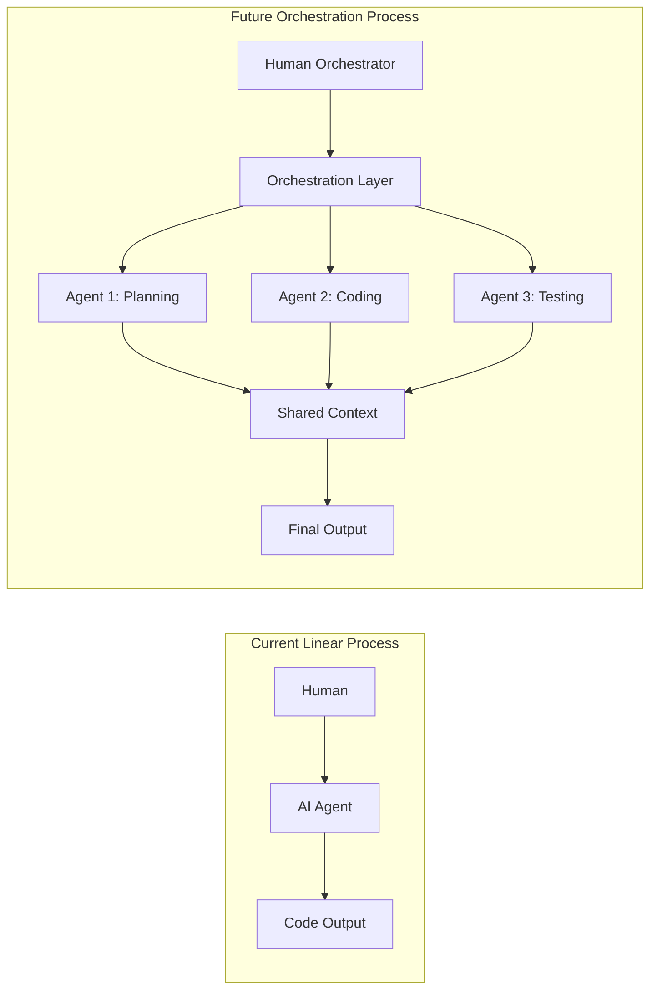
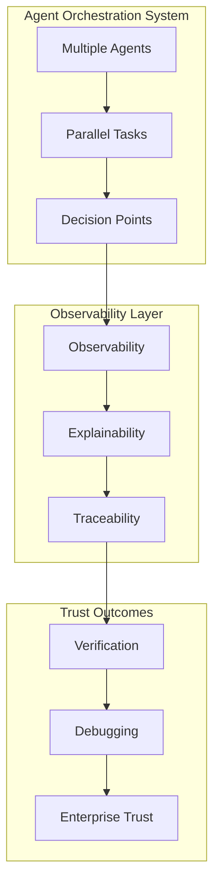

I've had a front-row seat to the AI orchestration challenge that most developers don't see coming. Here's what that experience taught me about where the industry is heading.

Software development has a classic three-act structure. We're living through Act Two, and most people don't realize it yet.


*Source: [Writing for Film: The Three Act Structure](https://thediscerningwriter.wordpress.com/2016/04/20/writing-for-film-the-three-act-structure/)*

**Act One** was the **craft era**. Individual developers writing code, line by line, function by function. Tools helped us type faster--IDEs, autocomplete, stack overflow searches--but the fundamental unit remained human intelligence applied to logical problems.

**Act Two** is the **assistant era**. We have AI that helps us code faster. Claude Code, OpenAI Codex, Cursor, Devin, Cline, Aider, Amp--smart tools that autocomplete thoughts, generate functions, debug errors. Still fundamentally human-driven, still linear, and mostly one-agent-per-human workflows.

**Act Three** is the **orchestration era**. This is where agent becomes cheaper than human labor, where agents coordinate with other agents, where development transforms from individual craft to systematic process management. This is where we benefit from a massive exponent enabled by agents.

```mermaid
%%{init: {'theme': 'dark', 'themeVariables': { 'primaryColor': '#1f2937', 'primaryBorderColor': '#374151', 'primaryTextColor': '#f3f4f6', 'lineColor': '#6b7280', 'sectionBkgColor': '#111827', 'tertiaryColor': '#1f2937' }}%%
timeline
    title AI Development Evolution
    section Act One: Craft Era
        Individual developers : Writing code line-by-line
        Human intelligence : Basic tools
    section Act Two: Assistant Era
        AI helps humans : Code faster
        One human, one agent : Linear process
        Current industry : Standard
    section Act Three: Orchestration Era
        Agents coordinate : With other agents
        Systematic process : Management
        Exponential : Complexity & productivity
```

Most of the industry is still thinking in Act Two terms.

## The Linear Trap

Current AI coding tools follow the same pattern: **one human, one agent, one linear process**. You prompt, the agent responds, you iterate. Even the most sophisticated tools, and I've worked with most of them over the past year in dev tools, operate within this single-threaded paradigm.

Humans are really bad at multitasking. I've lived through months of **Agent Maxing** (running as many agents and burning as many tokens as possible), but there's an upper limit and painful risk of burnout. It can be done, but it takes a special type of human effort.

The promise was **exponential productivity gains**. The reality has been **incremental improvements**. Faster autocomplete. Smarter code generation. Better debugging assistance. All valuable, but fundamentally limited by human throughput and creativity.

Here's the constraint: **humans are still the bottleneck**. We prompt one agent at a time, review one output at a time, manage one workflow at a time. The agent's compute capacity vastly exceeds our ability to coordinate it effectively.

> This is like having a Formula One car but driving in city traffic. The limitation isn't the engine, it's the infrastructure.



## Beyond Human-Scale Processes

From my work with engineering companies across B2C and B2B contexts, I've observed something consistent: **development is never actually individual work**. It's orchestrated process work. Multiple people, multiple steps, multiple handoffs, multiple verification loops.

We have Kanban boards, JIRA workflows, code review processes, CI/CD pipelines--all attempts to systematize complexity beyond what any single person can manage. But these processes were designed for human constraints: limited working memory, sequential attention, communication overhead.

What if we removed those constraints?

Agent orchestration isn't just "multiple AI assistants." It's fundamentally rethinking development workflows for systems that can:
- Process multiple contexts simultaneously
- Maintain perfect working memory across tasks
- Coordinate without communication overhead
- Scale compute resources dynamically
- Execute complex workflows without human supervision

The processes we build for AI agents can be **exponentially more complex** than anything humans could manage directly.

## The Observability Problem

But there's a catch. When you have multiple agents working in parallel, coordinating tasks, making decisions--how do you know what they're doing? How do you verify outcomes? How do you debug failures?

This isn't just a technical problem. It's a trust problem. Enterprise teams won't adopt **black-box agent systems**, no matter how impressive the output. They need **observability, explainability, traceability**.



You need to see:
- What was planned vs. what was executed
- Which agents made which decisions
- How tasks were decomposed and coordinated
- What verification steps confirmed correctness
- Where failures occurred and why

Current single-agent tools sidestep this by keeping everything human-supervised. But orchestrated systems require new interfaces, new dashboards, new ways of understanding complex parallel processes.

## The Orchestration Infrastructure Race

This is where the industry gets interesting. Across AI development tools, we're seeing evolution from simple assistants to agent orchestration suites, and the development velocity has been unlike anything we've seen in dev tools.

Leading platforms aren't just building faster autocomplete. They're building infrastructure for coordinated agent workflows:

**Multiple Agents, Isolated Contexts**: Parallel execution without collision, each agent working in separate contexts but coordinating through shared understanding.

**Plan-First Architecture**: Before any code changes, establish shared understanding of scope, requirements, verification criteria. Create a contract that multiple agents can execute against simultaneously.

**Observability Throughout**: Task dashboards showing real-time progress across parallel workstreams. Systems explaining not just what changed, but why. Verification reports confirming each subtask meets its acceptance criteria.

**Interface Evolution**: Multiple interfaces reflecting different orchestration needs, from IDE extensions to standalone orchestration platforms. The interfaces will evolve, but the core insight about systematic process management remains.

This isn't perfect yet--it's early-stage infrastructure for a future that most developers haven't internalized. But the architectural decisions across the industry reflect genuine understanding of the orchestration challenge.

## Three Bets That Shape the Future

Based on this experience and broader industry observation, I see three key bets that will determine winners in the agent orchestration era:

**Bet 1: Process Complexity Will Explode**
Human-designed workflows were constrained by what people could manage. Agent-orchestrated workflows can be exponentially more complex--more parallel streams, more verification loops, more sophisticated coordination patterns. Teams that embrace this complexity advantage will outproduce teams stuck in human-scale thinking.

**Bet 2: Interfaces Matter More Than Models**
The foundational models will commoditize. GPT, Claude, Gemini, Zhipu, Kimi, Qwen, etc.--they'll all become good enough for most coding tasks. I have swapped my Claude with GLM-4.5 in Claude Code, and still have to figure out the differences. **Competitive advantage shifts** to orchestration interfaces: how effectively can you coordinate multiple agents? How clearly can you observe complex workflows? How quickly can you iterate on process design?

**Bet 3: Security Becomes Systematic, Not Reactive**
Current AI coding tools require post-generation security review. Orchestrated systems can build security into the workflow architecture: sandboxed execution environments, formal verification steps, automated compliance checking. Security stops being something you add afterward and becomes something the orchestration system enforces systematically.

## Why Orchestration Matters

The most forward-thinking teams in AI development have been building toward Act Three since day one. Their execution velocity and systematic approach to the observability problem suggest they understand the transition we're navigating.

They're building toward a future where development teams orchestrate AI processes rather than using AI tools. Where compute scales exponentially but human oversight remains **strategic rather than tactical**. Where complexity multiplication creates genuine competitive advantages rather than just faster typing.

It's still early. There's significant execution risk across the industry. The interfaces will evolve. But the fundamental insight about orchestration-first development feels directionally correct for the industry transition we're experiencing.

Most of the industry is still optimizing for Act Two. The teams preparing for Act Three will have exponential advantages when the infrastructure matures.

