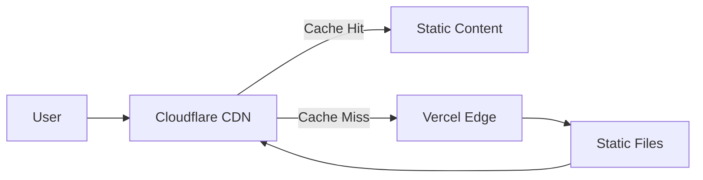
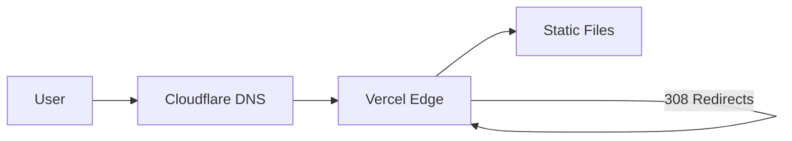

My site is "static." It's an Astro site deployed to Vercel. There's no database, no API routes, no server-side rendering. Just pre-generated HTML, CSS, and a sprinkling of JavaScript for animations.

So when an article I wrote hit the front page of Hacker News, I figured: *what could go wrong?*

Static is cheap. Static is simple. Static scales.

Right?


<blockquote class="featured-quote primary">
"595,557 edge requests in a single day"
</blockquote>


That's what Vercel metered on January 21st. Along with 38.2 GB of data transfer (about 67 KB per request on average).

For context: that single day's traffic consumed more than half of Vercel's Hobby plan monthly quota (1M edge requests). It officially took 21 days to burn through the entire free tier allocation, thanks largely to that HN kick.

On the Hobby plan, which includes a generous 1M edge requests and 100GB of bandwidth per month. (After that, projects get paused, not billed, on the free tier. But I was watching the numbers climb with some nervousness.)

## The Setup

Here's what I thought I had:

- Astro generating static HTML at build time
- Vercel serving those static files from their edge network
- Cloudflare sitting in front as DNS and... something about caching?

I assumed "static hosting" meant "Vercel serves the file once, caches it everywhere, and subsequent requests are basically free."

I was wrong about half of that.

## The Twist

Cloudflare was *not* proxying my traffic. The "Proxied" orange cloud was turned off in my DNS settings.

Here's what that actually means: Cloudflare was only handling DNS lookup. Once a visitor resolved my domain, their browser connected **directly to Vercel**. Cloudflare was out of the picture.

So every request looked like this:

```
User → DNS lookup (Cloudflare) → User connects directly to Vercel Edge → Static File
```

Vercel's edge network was handling every single request. And here's the thing I missed: **Vercel *is* a CDN that caches at the edge.** The problem wasn't that there was no caching.

The problem was that **"cached" doesn't mean "unmetered."**

Vercel serves traffic through its CDN/edge network. It can cache content at the edge, but Edge Requests count both cache hits and misses, and data transfer is metered by bytes moved. So caching reduces origin work, not necessarily request or bandwidth charges.

On a normal day? No problem. My site gets maybe a few hundred visits.

On Hacker News frontpage day? **Problem.**


## The Redirect Confusion

While I was watching the bandwidth graphs, I noticed something else: my site was issuing 308 redirects.

Vercel's trailing slash normalization was kicking in, converting URLs to canonical form with or without trailing slashes. Each redirect meant another round trip to the origin.

Here's where I need to be honest: since Cloudflare was in DNS-only mode at the time, it wasn't participating in these redirects at all. The 308s were coming entirely from Vercel's URL normalization.

I spent some quality time with `curl -IL` tracing redirect chains and verifying which hop was issuing what. Spoiler: when you see redirect weirdness, *actually trace the headers* before you invent elaborate theories about which system is doing what.

## The "Static"... Sort Of

Here's where I need to eat some crow.

I said earlier: "no database, no API routes, no server-side rendering. Just pre-generated HTML."

But Vercel's dashboard showed **48,967 function invocations** that day.

**Mystery solved:** Those were the OG image generation endpoints (`/api/og/*`). Each OG image route was a serverless function, and with 0% cache hit at the time, every request triggered a function invocation. With multiple OG endpoints getting ~19K requests each, the math checks out.

This is exactly the kind of thing that's easy to miss when AI agents are doing most of the implementation. The code works, images generate correctly, but the runtime cost model only becomes visible under stress.

The lesson: "static" frameworks can still execute compute at the edge through API routes, and those add up fast when they're not cached.

## The AI Meta

Here's something I haven't mentioned yet: this entire site was built and is maintained using AI coding agents.

The architecture, the component structure, even this article you're reading—all of it emerged from a collaboration between me and various AI tools. It's been incredibly productive. Features get implemented fast, patterns stay consistent, and I can iterate at a pace that would be impossible solo.

But there's a tradeoff.

AI agents are great at *making* things, but they're not always great at *understanding* the full context of what they've made. That 49K function invocations mystery? An AI agent might have noticed it, but would it have connected it to the Cloudflare proxy being off? Would it have thought to check `curl -IL` output?

Maybe. Probably not.

This is the double-edged sword of AI-assisted development: you move faster, but you accumulate subtle inefficiencies that only reveal themselves under stress. Like, say, a Hacker News frontpage spike.

I wrote more about this approach in my [architecture](http://nibzard.com/architecture) article, including the agent-friendly stack choices that make this workflow possible. The short version: AI agents are force multipliers, but you still need to understand your infrastructure. Sometimes painfully.

## The Fix

Okay, two problems:

1. **Cloudflare proxy off**: Every request hits Vercel's edge
2. **Redirect loops**: Wasteful round trips

Here's what I did:

### Step 1: Enable Cloudflare Proxy

Flipped the orange cloud on in DNS settings. Now requests flow through Cloudflare's network:

```
User → Cloudflare → Vercel Edge (if cache miss)
```

Important caveat: **Cloudflare doesn't cache HTML by default.** Their default cache behavior skips HTML and JSON files. You need Cache Rules or appropriate `Cache-Control` headers to make that happen. So enabling proxy is step zero, not the whole solution.

### Step 2: Fix the Redirects

Cleaned up the trailing slash configuration in Vercel. No more 308 redirect chains.

### Step 3: Actually Configure Caching

Here's the thing: "static hosting" doesn't mean "automatically cached." You have to configure it.

- Set appropriate `Cache-Control` headers
- Configure Cloudflare caching rules
- Test with `curl -I` to verify headers

I'd been treating my hosting like a set-and-forget appliance. It's not. It's a system you have to *design*.


After enabling the proxy, Cloudflare showed ~44k requests with about 70% served from cache. Important caveat: **those 70% cache hits are mostly static assets**, not HTML. Cloudflare doesn't cache HTML by default. You need Cache Rules or specific `Cache-Control` headers for that.

So the proxy helped, but it wasn't a magic bullet. My HTML was still passing through to Vercel on most requests.

But here's the reality check: MS Clarity showed about 18,761 sessions with ~1.25 pages per session—roughly 23,451 actual pageviews. Compare that to 700,000 Vercel edge requests, and you're looking at ~30 edge requests per pageview.


This is actually normal for modern sites. Edge requests count every CDN hit—fonts, CSS, JS, images, API calls—not just the HTML page load. The ratio looks alarming, but it's how serverless platforms meter traffic.

<blockquote class="featured-quote secondary">
"The day I learned: 'static' describes your build process, not your caching strategy."
</blockquote>

## The Meta

So I did what any self-respecting developer would do: I posted about my failure on X.

And Guillermo Rauch, CEO of Vercel, replied.


Super gracious of him to engage, honestly.

And here's something I want to be clear about: **Vercel's pricing is transparent and documented.** The Hobby plan gives you 1M edge requests and 100GB of bandwidth per month. That's pretty generous for a free tier. The platform isn't trying to trick anyone.

My expectations were wrong, not Vercel's billing.

That said, the conversation reinforced something I'd been realizing:

## Own Your Request Path

Here's my hot take:

**If you're deploying to a platform, you need to understand how every request flows through that platform.**

- Where does caching happen?
- What triggers a cache miss?
- What are the limits, and what happens when you hit them?
- Who pays for what, and when?

"Static hosting" is a lie. Or at least, it's a half-truth.

Your site might generate static files. But *serving* those files is dynamic. Request routing, TLS termination, cache decisions, redirect logic—all of it happens on every request.

Either your platform handles that efficiently, or you configure it to handle it efficiently.

But it doesn't happen by magic.

## The Architecture

Here's what I should have had from day one:



And here's what I actually had:



With DNS-only mode, Cloudflare resolves the domain and steps aside. The browser connects directly to Vercel, which serves the content (or issues redirects). Every request hits Vercel's edge and counts toward your quota.

## The Lesson

Hacker News gave my site a hug. It was warm and welcoming and absolutely terrifying.

But it also taught me something valuable:

**Your infrastructure is a garden, not an appliance.**

You can't just plant it and walk away. You need to tend it. Prune the redirect chains. Water the cache headers. Fertilize the... okay, I'm stretching the metaphor.

You know what I mean.

"Static" describes your *build process*, not your *caching strategy*. And "serverless" doesn't mean "no server." It means someone else's server, with clearly documented rules and quotas.

Understanding those rules? That's your job.

---

**Want to verify your own setup?** Run these to see what's actually cached:

```bash
# Check cache headers for a single request
curl -sI https://yourdomain.com/ | egrep -i 'HTTP/|cache-control:|cf-cache-status:|age:|server:'

# Trace redirect chains
curl -sIL https://yourdomain.com/some-path | egrep -i 'HTTP/|location:|cf-cache-status:'
```

`CF-Cache-Status: HIT` means Cloudflare served it from cache. `MISS` means it hit your origin.

---

*P.S. If you're reading this from Hacker News: hi! Please enjoy the site. And maybe check your caching strategy: Cloudflare proxy, cache headers, all of it. It pays to understand your request path.*
