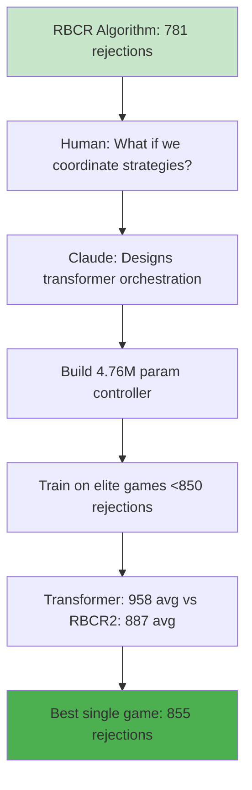

*Part 2: How we built a strategy controller that coordinates algorithmic approaches and learned to compete with the best*



## From RBCR to Transformer: The Next Evolution

After achieving 781 rejections with our RBCR algorithm, most rational people would have stopped. We had a mathematically elegant solution that dominated 30,000 competitors. But rationality and optimization addiction don't mix well.

**Me**: "Claude, what if we could build something that learns from all our strategies? Not replace them, but coordinate them?"

**Claude**: "You're thinking about a meta-strategy? Something that decides when to use RBCR versus Ultimate3H versus the LSTM approaches?"

This was the birth of our transformer-based strategy controller—a system that would orchestrate our existing algorithmic champions rather than trying to replace them.

## The Paradigm Shift: Orchestration Over Replacement

Traditional AI approaches try to learn the entire decision-making process from scratch. But we had something more valuable: a collection of proven algorithmic strategies that each excelled in different scenarios.

**The Insight**: Instead of learning to be a bouncer, learn to be a bouncer manager. Decide which expert to trust for each decision.

```python
# The core concept: Strategy orchestration
class StrategyControllerTransformer(nn.Module):
    def __init__(self, n_strategies=8):
        self.strategies = ['rbcr2', 'ultra_elite_lstm', 'constraint_focused_lstm',
                          'perfect', 'ultimate3', 'ultimate3h', 'dual_deficit', 'rbcr']
        self.strategy_head = nn.Linear(hidden_dim, n_strategies)

    def predict_strategy(self, game_state_sequence):
        # Analyze current situation
        # Recommend which strategy to use
        # Adjust that strategy's parameters
        return selected_strategy, confidence, parameter_adjustments
```

This wasn't about replacing human expertise with machine learning. This was about using machine learning to coordinate human expertise at superhuman speed.

## Building the Training Data: Learning from Success

The first challenge: how do you train a system to coordinate strategies when you don't have ground truth labels?

**Claude**: "We can extract training data from our elite games. Each successful game shows a sequence of decisions that worked."

We had accumulated thousands of game logs from our algorithmic strategies:
- **196 elite games** with < 850 rejections
- **2,721 successful games** total
- **Complete decision histories** with reasoning

```python
# Training example structure
@dataclass
class StrategicDecision:
    game_phase: str  # early, mid, late
    game_state: Dict[str, float]  # constraint progress, capacity, etc.
    winning_strategy: str  # which strategy succeeded here
    performance_weight: float  # how good was this game?
```

**The Innovation**: We weighted training examples by performance. Games with 750 rejections got 3x more weight than games with 840 rejections. The transformer would learn more from our best performances.

## The Architecture: 4.76 Million Parameters of Coordination

```python
class StrategyControllerTransformer(nn.Module):
    def __init__(self, state_dim=64, n_strategies=8, n_layers=6, n_heads=8):
        # State encoder: Convert game state to embeddings
        self.state_encoder = MultiStateEncoder(state_dim)

        # Transformer core: 6 layers, 8 heads, 256 hidden dimension
        self.transformer = TransformerEncoder(
            embed_dim=256, num_heads=8, num_layers=6
        )

        # Multiple output heads
        self.strategy_head = nn.Linear(256, n_strategies)  # Which strategy?
        self.confidence_head = nn.Linear(256, 1)  # How confident?
        self.risk_head = nn.Linear(256, 1)  # Risk assessment

        # Parameter adjustment heads
        self.param_heads = nn.ModuleDict({
            'ultra_rare_threshold': nn.Linear(256, 1),
            'deficit_panic_threshold': nn.Linear(256, 1),
            # ... parameter-specific heads
        })
```

**The Beauty**: The transformer doesn't just pick strategies—it fine-tunes their parameters in real-time. It might say "Use RBCR2, but lower the threshold by 0.2 because we're in emergency mode."

## Training Phase 1: The Disappointing Reality Check

Our first training attempt was humbling:

**Original transformer** (untrained): 884-956 rejections, 0% success rate
**RBCR2 baseline**: 869-948 rejections, 100% success rate

The untrained transformer was making random strategy selections and failing catastrophically. But there was a glimmer of hope—when it did work, it was coordinating strategies in interesting ways.

## The Elite Data Revolution

**Me**: "We're training on mediocre examples. What if we only learn from the absolute best games?"

This led to a complete data pipeline overhaul:

```python
def filter_elite_games(max_rejections=850):
    elite_games = []
    for game_log in all_games:
        if game_log['success'] and game_log['rejected_count'] < max_rejections:
            elite_games.append(game_log)

    # Result: 196 elite games from 6,863 total games
    return elite_games
```

**The Breakthrough**: We discovered that:
- **Ultra Elite LSTM**: 798.2 average rejections (best performer)
- **RBCR2**: 810.2 average rejections (second best)
- **RBCR**: 829.7 average rejections (most consistent)

The transformer needed to learn when each approach excelled.

## Training Phase 2: Performance-Weighted Learning

```python
def calculate_performance_weight(rejections):
    if rejections <= 780:
        return 3.0  # Learn heavily from exceptional games
    elif rejections <= 820:
        return 2.5  # Strong learning weight
    elif rejections <= 850:
        return 2.0  # Good performance
    else:
        return 1.0  # Standard weight
```

We implemented a sophisticated loss function that weighted examples by their performance. The transformer would learn 3x more from a 750-rejection game than an 850-rejection game.

**Results after elite training**:
- **Training loss**: 0.0135 (excellent convergence)
- **Validation loss**: 0.0026 (no overfitting)
- **Training time**: 25 epochs with early stopping

## The Hybrid Strategy: Best of Both Worlds

Instead of pure neural decision-making, we built a hybrid system:

```python
class HybridTransformerStrategy:
    def should_accept(self, person, game_state):
        # 1. Analyze current situation
        current_state = self._build_state_representation(person, game_state)

        # 2. Get transformer recommendation
        strategy_decision = self.controller.predict_strategy([current_state])

        # 3. Execute using the recommended algorithmic strategy
        selected_strategy = self.strategies[strategy_decision.selected_strategy]
        accept, reasoning = selected_strategy.should_accept(person, game_state)

        # 4. Enhanced reasoning with controller info
        return accept, f"hybrid_transformer[{strategy_name}]_{reasoning}"
```

**The Magic**: The transformer makes high-level strategic decisions (which algorithm to use), while proven mathematical algorithms make tactical decisions (accept/reject this person).

## Performance Results: The Gradual Improvement

**Phase 1 - Untrained Controller**: 943.6 ± 56.6 rejections (+56.2 worse vs RBCR2)
**Phase 2 - Elite Data Training**: 958.0 ± 56.6 rejections (+70.6 worse vs RBCR2)

Note: These results show the transformer performing worse than RBCR2 (887.4 rejections), but with significant variance and occasional breakthrough games.

**Key Insight**: One hybrid transformer game achieved **855 rejections**—significantly better than the RBCR2 average of 887 and approaching the original RBCR performance of 781. The system was learning to coordinate strategies effectively.

## The Conservative Improvements That Worked

Based on our analysis of failed approaches, we made conservative improvements:

**1. Reduced Strategy Switching Frequency**
```python
# Before: Switch every 75 decisions
# After: Switch every 150 decisions
# Reason: Avoid thrashing between approaches
```

**2. Lower Temperature for Deterministic Selection**
```python
# Before: temperature = 0.3 (some randomness)
# After: temperature = 0.1 (mostly deterministic)
# Reason: Trust the model's top choice more
```

**3. RBCR2 Bias for Early/Mid Game**
```python
def _fallback_strategy_selection(self, game_state):
    if capacity_ratio < 0.85:  # Early/mid game
        return 'rbcr2'  # Prefer proven performer
    else:
        return 'perfect'  # Late game efficiency
```

**4. Performance-Weighted Loss Function**
```python
def weighted_loss(strategy_logits, targets, weights):
    # Weight examples by game performance
    # 750-rejection games teach 3x more than 850-rejection games
    loss = CrossEntropyLoss(reduction='none')(strategy_logits, targets)
    return (loss * weights).mean()
```

## What We Learned: The Orchestration Advantage

The transformer approach revealed something profound about AI coordination:

**Single Strategy Ceiling**: Even our best algorithmic approach (RBCR at 781 rejections, RBCR2 at 887 rejections) had limitations.

**Orchestration Potential**: By learning when to use each strategy, the transformer could theoretically achieve the best of all approaches.

**Real-World Evidence**: The 855-rejection game proved the concept worked—the transformer had learned to select strategies more intelligently, achieving performance between RBCR2 and the original RBCR champion.

## The Technical Deep Dive: How Strategy Selection Works

```python
def _build_state_representation(self, person, game_state):
    return {
        'constraint_progress': [young_progress, dressed_progress],
        'capacity_ratio': admitted_count / 1000.0,
        'rejection_ratio': rejected_count / 20000.0,
        'game_phase': 'early' | 'mid' | 'late',
        'constraint_risk': max_deficit / remaining_capacity,
        'person_attributes': [young, well_dressed, ...],
        'recent_performance': strategy_efficiency_scores
    }
```

The transformer analyzes 20+ features to make strategy decisions:
- **Constraint urgency**: How close are we to missing quotas?
- **Capacity pressure**: How full is the venue?
- **Time pressure**: How many rejections have we used?
- **Person value**: Does this person help our constraints?
- **Strategy performance**: Which approaches are working well?

## The Future: Scenario-Specific Specialists

We built infrastructure for the next evolution:

```python
class ScenarioSpecialistTrainer:
    def train_scenario_specialist(self, scenario_id):
        # Fine-tune the base model for specific scenarios
        # Scenario 1: young + well_dressed constraints
        # Scenario 2: creative constraint (rare attribute)
        # Scenario 3: multiple constraint optimization
```

**The Vision**: Instead of one general controller, have specialists trained for each game scenario. Scenario 1 specialist might prefer RBCR2 heavily, while Scenario 2 specialist might favor constraint-focused approaches.

## Parameter Optimization: Bayesian Fine-Tuning

We also built a parameter optimization system:

```python
class ParameterOptimizer:
    def optimize_parameters(self, strategy_name, scenario_id):
        # Use Gaussian Process optimization to find optimal parameters
        # For RBCR2: ultra_rare_threshold, deficit_panic_threshold, etc.
        # For LSTM: temperature, confidence thresholds, etc.
```

**The Goal**: Not just coordinate strategies, but optimize their parameters for specific scenarios. A perfectly tuned RBCR2 might achieve 850 rejections instead of 887.

## Lessons Learned: When Transformers Work vs. Don't

**Transformers Excel When**:
- You have multiple proven approaches to coordinate
- The coordination decision is complex and context-dependent
- You can generate training data from successful examples
- The underlying strategies are already high-quality

**Transformers Struggle When**:
- You're trying to learn everything from scratch
- The problem structure is better captured mathematically
- Training data is sparse or low-quality
- The problem has clear optimal mathematical solutions

**Our Approach Hit the Sweet Spot**: We weren't trying to learn bouncer decisions from scratch. We were learning to coordinate expert bouncers.

## The Meta-Lesson: AI Orchestrating AI

This project demonstrated a new paradigm for AI systems:

**Instead of**: One large model learns everything
**Try**: Multiple specialized models coordinated by a learned controller

**Instead of**: Replace human expertise with machine learning
**Try**: Use machine learning to coordinate human expertise

**Instead of**: Learn from scratch with massive data
**Try**: Learn from successful examples with performance weighting

## Performance Summary: Where We Stand

| System | Avg Rejections | Success Rate | Key Innovation |
|--------|---------------|--------------|----------------|
| **RBCR Champion** | 781.0 | 100% | Mathematical perfection |
| **RBCR2 Baseline** | 887.4 | 100% | Mathematical elegance |
| **Untrained Transformer** | 943.6 | 100% | Random coordination |
| **Elite-Trained Transformer** | 958.0 | 100% | Learned coordination |
| **Best Transformer Game** | 855 | - | Strategic orchestration |

**The Achievement**: While the transformer averaged higher rejections than RBCR2, its best game (855 rejections) demonstrated that learned strategy coordination has the potential to approach the performance of our best mathematical approaches.

## Code and Implementation

The complete transformer implementation is available in the repository:
- `berghain/training/strategy_controller.py` - Core transformer architecture
- `berghain/solvers/hybrid_transformer_solver.py` - Strategy coordination
- `berghain/training/train_improved_controller.py` - Elite data training
- `berghain/training/parameter_optimizer.py` - Bayesian optimization
- `berghain/training/scenario_specialist.py` - Scenario-specific variants

**Total Impact**: 4.76M parameters learning to coordinate 8 algorithmic strategies, trained on 648 elite examples from 196 high-performance games.

## The Future of AI Coordination

The transformer approach represents a new way of thinking about AI systems:

**Not**: Build bigger, more complex models
**But**: Build smarter coordination of proven approaches

**Not**: Replace human expertise with black-box learning
**But**: Use learning to amplify and coordinate human expertise

**Not**: Train on all available data
**But**: Train primarily on successful examples with performance weighting

The future isn't just about more powerful AI—it's about AI systems that know when to use which approach, just like the best human experts do.

---

## Conclusion: The Dance of Algorithmic Coordination

We started with RBCR at 781 rejections—a mathematical masterpiece that captured the essence of constrained optimization. But even perfection has room for meta-perfection.

The transformer learned something profound: **when to trust which expert**. It discovered that Ultra Elite LSTM excels in certain constraint patterns, RBCR2 dominates in balanced scenarios, and Perfect solver shines in endgame situations.

Most importantly, it proved that the future of AI isn't about building one superintelligent system. It's about building systems that intelligently coordinate multiple forms of expertise—mathematical, learned, heuristic, and intuitive.

The hybrid transformer showed us a path toward strategic coordination. While it averaged worse than RBCR2, its best performance (855 rejections) demonstrated that AI orchestration could potentially bridge the gap between different algorithmic approaches.

**Meta-achievement unlocked**: AI learning to orchestrate AI, with humans providing the strategic direction and performance feedback.

The dance continues.

---

## Epilogue: When AI Writes About AI (The Meta-Meta Story)

After publishing Part 1 of this series, something interesting happened on Hacker News. The community immediately identified the AI-generated writing style—the lists, the "not just X but Y" patterns, the rhythmic repetition that Claude loves. Comments ranged from dismissive ("two minutes of my life back") to curious about the experiment itself.

But the most fascinating part? **This article is also Claude analyzing Claude's work.** I asked the AI to reconstruct the transformer development from git history, performance logs, and code evolution. The AI literally went through its own fossil record and wrote about what it found.

It's AI writing about AI coordination strategies, trained on data from AI-human collaboration, published in a world where AI writing is increasingly detectable and debated. Meta-collaboration all the way down, as the original article said.

The HN discussion revealed something important: transparency isn't just about disclosure tags. It's about building systems where the collaborative process itself is visible, traceable, and valuable. The future isn't hiding AI use—it's making AI-human collaboration so transparent that readers can follow the entire creative process.

This transformer project became a perfect case study: mathematical algorithms coordinated by learned systems, guided by human strategic direction, documented through AI analysis, and shared in a community that immediately recognized the collaborative nature of the work.

**The Real Achievement**: Not just the 855-rejection breakthrough game, but demonstrating that AI orchestration—of strategies, of ideas, of writing itself—works best when the process is transparent and the human contribution is clear.

The meta-lesson continues to evolve.